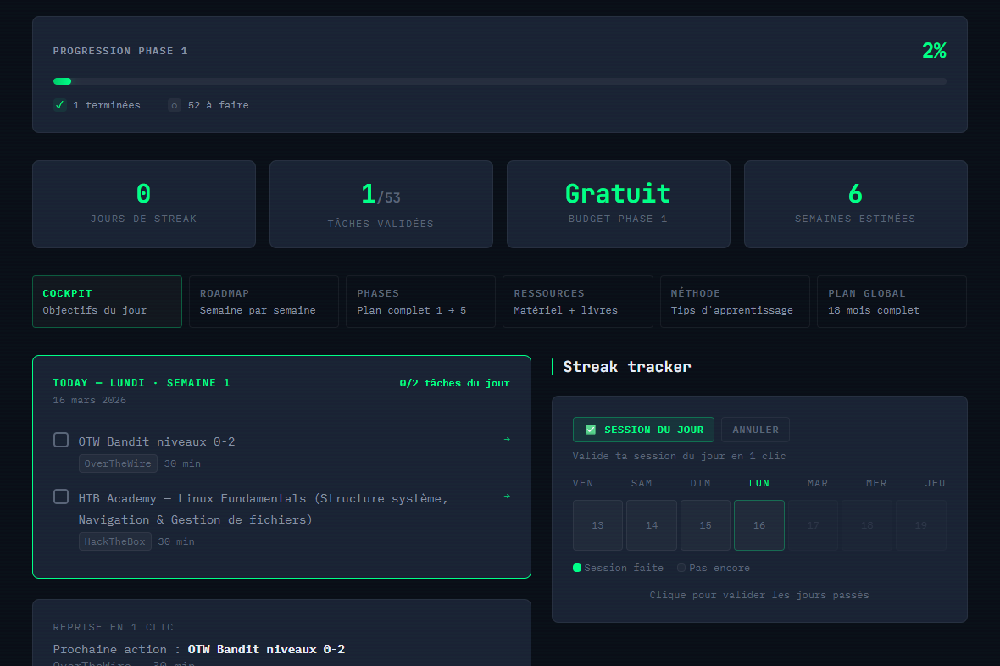
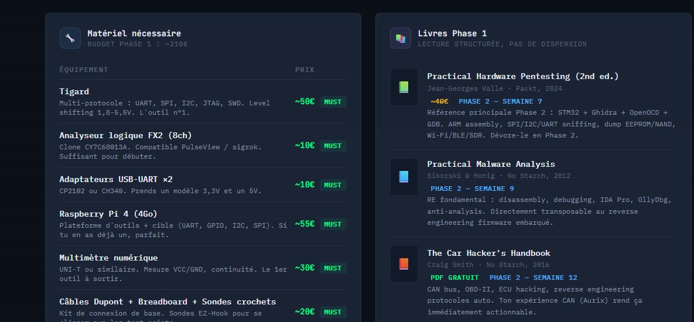

## The Jungle
The first thing that striked me when this whole pentest formation project began was the ressources available. Too much links, too much platforms, too much Youtube video... I've done stuff like this before (learning something new related to code) and I know that for myself, it's the best way to just get lost, start 1032 things in parallel, finish nothing and lose all motivation. This time, I wanted to do this correctly. For this, I need to know exactly what fields I need to cover, what I do NOT want to do, and then search ressources dor this.
So my first reflex was: "Let's ask Claude". Claude can fetch hundreds of website in research mode, so I went with a prompt like:
"I'm an embedded C developer, I've already worked with those targets, and I want to get better in IoT Pentesting, Hardware Pentesting, Report writting. Search for ressources and elaborate a plan".
And it did good !

## Create a plan
Once Claude gave me a first plan, I needed to refine it. The goals were clear:
- Being able to perform pentesting on hardware/IoT targets.
- I don't care about web stuff.
- I need to determine the ressources that will be used.
After refining the first plan, what I got was:
- A big todolist
- A realistic timeline
- What platform will be used
- What hardware stuff do I need
The main focus will be Hack The Box (HTB) basic courses along with some real challenges (OverTheWire for the beginning, hardware CTF then & HTB challenges)
## Create some tools
To keep my motivation and be able to follow my plan easily, I (and mostly Claude) created a small NextJS dashboard.
The goal is to have in the same place the current TODOs, my streak, which phase I'm in & the current progression.
I'm pretty happy with this tool, it looks great and will be super helpful to keep my motivation high.

(The dashboard is in french but you can see here the landing page daily todolist & the hardware to buy / useful books).
This blog is also one of the tool I'm using to keep myself motivated. I've learned the importance of writeups whenever I'll do big challenges. Posting them online will be helpful to have a portfolio. Having my journey documented feels great as well.

## What's next ?

Well, starting the actual process ! I've already set up a computer with a Kali running on it and subscribed to HTB. I've done some easy challenges as well (Reverse Engineering on RootMe), but the focus now will be on Linux basics as recommended in my plan and the first OTW levels !